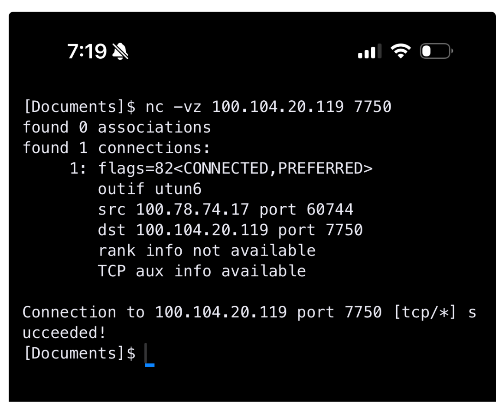

# Mesh test status (current)

## Overall plan: presence and discovery (2026-05-06)

**Purpose:** Record the multi-track discovery direction so it survives partial sessions.

### Two independent tracks (both required long-term)

1. **LAN presence (mDNS / Avahi)** — Browse for peer advertisements on the local subnet. **Join/leave** is approximated by browse **Added** / **Removed** (and timeouts when a host disappears without goodbye). This only means “something is advertising”; it does **not** prove SIL or libp2p connectivity.
2. **libp2p-level peers** — Peers seen via libp2p’s own discovery (**mDNS inside libp2p**, DHT, bootstrap, rendezvous, etc.). This does **not** automatically populate SIL `sil_mesh --host`/`--port` until a mapping exists.

Each track must **work on its own** without the other.

### Bridge (additive)

Correlate the two for one logical node: mDNS **TXT** carries `mesh_uri`, `sil_port`, optional libp2p **Peer ID**; libp2p carries **multiaddrs**. **`sil_mesh discover`** + **`config/discovered_peers.yml`** implement the LAN side and merge libp2p JSONL; **`sil_mesh send --use-registry`** resolves **`mesh_uri` → TCP host:port**. Full libp2p↔SIL bridging is still **incremental** (same file can hold both after coalesce by `peer_id`).

**Durable detail:** [`DISCOVERY_PLAN.md`](./DISCOVERY_PLAN.md) — includes **validated local** receive → advertise → discover → send (`pong`).

**LAN tooling:**

```bash
cd 04_infrastructure/mesh
.venv/bin/python scripts/lan_presence_browse.py
.venv/bin/python scripts/lan_presence_browse.py --legacy-http
.venv/bin/python scripts/lan_presence_advertise.py --port 7750 --mesh-uri mesh://fieldlight.anni.lemur
.venv/bin/python scripts/sil_mesh.py discover --duration 8 --legacy-http
.venv/bin/python scripts/sil_mesh.py discover --merge --libp2p-jsonl /tmp/libp2p_events.jsonl
.venv/bin/python scripts/sil_mesh.py send send/examples/ping_to_peer.yml --use-registry
```

**libp2p probe (Track B):** `discovery/libp2p_peer_probe` — `go run .` (see `DISCOVERY_PLAN.md`).

**Note:** Cross-host SIL blockers in this file are **unchanged**; discovery runs **in parallel** and does not by itself fix Tailscale/TCP path issues to Peej.

---

## Session outcome

- Local single-machine test: **PASS** (`ping` → `pong`)
- Local **discovery path** (2026-05-06): **PASS** — `lan_presence_advertise` → `sil_mesh discover` → `sil_mesh send --use-registry` → **`pong`** (see **Validated end-to-end** in [`DISCOVERY_PLAN.md`](./DISCOVERY_PLAN.md))
- Cross-machine test (Anni → Peej over public IPv6): **BLOCKED** (TCP connect timeout)
- Cross-machine test (Anni → Peej over Tailscale `100.104.20.119`:**`7750`): **BLOCKED** (TCP connect timeout from sender node)

## What has been confirmed

- Peej receiver process runs and listens on **`7750`**.
- Tailscale control path exists (`tailscale ping` succeeds from sender).
- Sender payload is valid and uses `to: mesh://peejmachine`.
- SIL handler and framing are **not** the failure point when TCP fails: **raw TCP connect times out** before any protocol exchange (sender side).
- **Peej’s side (receiver stack):** independent checks show the listener stack is healthy (see **2026-03-29** below).

---

## 2026-03-29 — Event log (timeout, follow-up, isolation)

### What happened

1. **Earlier:** IPv6 global address (`2601:…`) path timed out from sender → shifted focus to **Tailscale** addressing.
2. **Tailscale:** `ping` / control-plane checks looked alive; **`sil_mesh send`** from the Debian sender to **`100.104.20.119:7750`** still **timed out** (same class of failure: no TCP completion before app layer).
3. **Same tailnet (Peej):** From a second device on Peej’s tailnet, connecting **worked** (no timeout; host reachable). Response bytes were hard to interpret in that shell context—**transport reached**, application framing not yet validated in that session.
4. **Independent verification (Peej, iPhone, a-Shell):** `nc -vz 100.104.20.119 7750` **succeeded** (`Connection to 100.104.20.119 port 7750 [tcp/*] succeeded!`). Source on tailnet `100.78.74.17` → dest `100.104.20.119:7750` via `utun6`. This proves **raw TCP to `peejmachine:7750` works from another tailnet host** on Peej’s side.



5. **Peej self-test against live receiver:** Full **end-to-end success** on his machine: `ping` delivered to `mesh://peejmachine`, **`response_200`** with **`intent: pong`**, **routing** and **audit** logs written. Confirms **listener, framing, route handling, and response path** on the receiver host.

### Working hypothesis (not yet proven)

- **Receiver / Peej-local path:** looks **clean** (see `nc` + self-test).
- **Remaining gap:** **ingress from the sender’s Debian node/runtime** to **`100.104.20.119:7750`** — e.g. **userspace TCP** not actually taking the same path as “Tailscale looks up,” or **sender-side** **`nftables` OUTPUT**, **routing**, or **wrong target** for `100.104.20.119` vs `tailscale0` / IPv4 vs IPv6.
- **Ping vs TCP:** ICMP (or Tailscale “ping”) succeeding does **not** prove **TCP** to the **same port** is permitted on the full path from sender to receiver.

### What was tried / ideas for next

| Item | Action |
|------|--------|
| `nc -vz` from **sender** | Run **`nc -vz 100.104.20.119 7750`** (or `telnet`/`python` socket) **from the Debian box** that runs `sil_mesh send` — not only from Peej’s phone. |
| Packet capture | On next attempt: capture on **sender** egress and/or **receiver** ingress to see SYN/ACK vs RST/drop. |
| Reverse direction | **Peej → Anni** TCP test (same port, `sil_mesh` or `nc`) to see if path is **asymmetric**. |
| Simple HTTP listener | Peej opens **`python3 -m http.server 7750 --bind 0.0.0.0`** (or `::`); sender runs **`curl -v http://100.104.20.119:7750/`** to separate **TCP vs SIL framing** confusion. |
| OS nuance | Explicitly note **Linux (sender) ↔ macOS (receiver)** differences only if captures show a pattern; default assumption is **path/policy**, not OS bug. |

### Success criteria (unchanged)

Sender prints YAML **`response`** with **`status: 200`** and **`intent: pong`** from the remote host. Logs **after** first success.

---

## Current blocker

**Network path / policy from sender node to Peej’s Tailscale service address `100.104.20.119:7750`**, not SIL schema or Peej’s local receiver implementation (per Peej-local checks above).

## Next steps (ordered)

1. From **Anni’s Debian sender** (same host as `sil_mesh`): run **`nc -vz 100.104.20.119 7750`** (and `curl -v` if HTTP server test is agreed).
2. If **timeout** persists: inspect **sender** routing to **`100.104.20.119`** (`ip route get`, `tailscale status`), **`nftables`/`iptables` OUTPUT**, and **`nft`** counters on **DROP**/**REJECT**; optional **tcpdump** on sender and receiver.
3. Optional **reverse-direction** test (Peej → Anni) on same port.
4. Re-run **`sil_mesh send`** with **`--host 100.104.20.119 --port 7750`** once raw TCP reaches **`succeeded`** from the sender.
5. After first success, capture logs and append a dated line to this file.

## Commands (retest)

Sender:

```bash
.venv/bin/python scripts/sil_mesh.py send send/examples/ping_peej_live_test_01.yml --host 100.104.20.119 --port 7750
```

Receiver (Peej — bind all interfaces; adjust for IPv6-only if needed):

```bash
.venv/bin/python scripts/sil_mesh.py receive --host 0.0.0.0 --port 7750 --node-id mesh://peejmachine
```

**Pre-flight from sender (same machine as `sil_mesh`):**

```bash
nc -vz 100.104.20.119 7750
```
